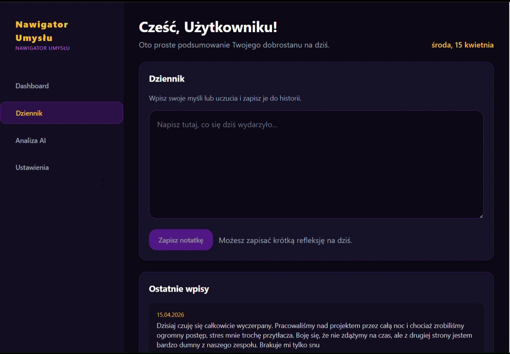

# Nawigator Umysłu — AI mood journal that keeps personal data on your own server

A full-stack journaling app: you write how your day went, a Polish LLM answers you, and
weekly/monthly reports show how your mood moves over time. Answers can be played back as
speech.

**The part worth reading the code for:** entries are analysed by an *external* LLM, but no
name, e-mail, phone number or place ever leaves the machine — text is stripped of personal
data first, locally.

🏆 Built at the **final round of the Kielce University of Technology hackathon** (April
2026) — a team of five, one night, 50 commits.
🎥 **[Demo video](https://github.com/HeorhiHalavach/hakaton-AI/releases/download/demo/Video.mp4)** · 📄 **[Full technical documentation (PL)](docs/README.md)**
· 🔌 **[OpenAPI spec](docs/openapi.yaml)**



<sup>A frame from the demo recording: the journal screen with the day's entry and the list of previous ones.</sup>

---

## What it does

| Feature | How |
|---|---|
| Mood analysis of every entry | local Hugging Face pipeline, Polish model `bardsai/twitter-sentiment-pl-base` |
| A written reply to the entry | **Bielik** (Polish LLM) through an OpenAI-compatible client |
| Weekly / monthly reports | aggregated over the last 7 and 30 days |
| Reply read out loud | `edge-tts` → MP3, played in the browser |
| Separate data per user | anonymous `user_id` generated in the browser, kept in `localStorage` |
| Light / dark, responsive | Tailwind CSS |

---

## 🔒 Why personal data never reaches the LLM

The interesting problem in a mood journal is that the text is **the most private thing a
user has** — and to analyse it well you want a large model you do not host. Our answer was
a sanitising layer in front of the external call (`backend/anonymizer.py`):

| Layer | What it removes | Replaced with |
|---|---|---|
| Regular expressions | e-mail addresses, phone numbers (incl. `+48`) | `<EMAIL>`, `<TELEFON>` |
| Named-entity recognition — spaCy `pl_core_news_md` | first names and surnames, cities and places | `<OSOBA>`, `<MIEJSCE>` |

Everything the model sees is already masked. The original text stays in the local database
and is never written to logs that go to the provider.

Three more habits from the same file set:

- **Strict input schemas.** Every request to `/api/analyze` is validated by a Pydantic
  model; a wrong type or a missing field is rejected with `422` instead of entering the
  analysis pipeline.
- **No SQL string building.** All database access goes through SQLAlchemy ORM, so queries
  are parameterised — SQL injection has no surface.
- **No stack traces to the client.** Endpoints return `{"status": "error", "message": …}`;
  the trace stays on the server.

---

## Stack

**Frontend** React + Vite · Tailwind CSS · context-based state
**Backend** FastAPI · SQLAlchemy · SQLite · Pydantic
**AI** Hugging Face `transformers` (sentiment, local) · Bielik LLM (remote) · spaCy NER
**Audio** `edge-tts`

---

## Run it

Backend:

```bash
cd backend
python -m venv .venv && .venv\Scripts\activate      # Linux/macOS: source .venv/bin/activate
python -m pip install fastapi uvicorn sqlalchemy edge-tts pydantic transformers spacy
python -m spacy download pl_core_news_md
uvicorn main:app --reload --port 8000
```

Frontend:

```bash
cd frontend
npm install
npm run dev
```

Point the frontend at the API with `frontend/.env`:

```env
VITE_API_BASE_URL=http://localhost:8000
```

---

## API

| Method | Endpoint | Purpose |
|---|---|---|
| `POST` | `/api/analyze` | analyse an entry and store it |
| `GET` | `/api/history?user_id=` | that user's entries with AI replies |
| `GET` | `/api/statistics/weekly?user_id=` | last 7 days |
| `GET` | `/api/statistics/monthly?user_id=` | last 30 days |
| `POST` | `/api/speak` | text → MP3 via `edge-tts` |
| `DELETE` | `/api/clear` | wipe entries (development only) |

Full request/response shapes: [`docs/openapi.yaml`](docs/openapi.yaml).

---

## Tests

`backend/tests.py` and `backend/test_api.py` cover the paths that matter: analysing a new
entry, reading a user's history, and building the weekly and monthly statistics. They drive
the API over HTTP and assert on the JSON, so they exercise validation and error handling
together with the logic.

```bash
cd backend && python -m pytest
```

---

## My part in this

Five people worked on it; I wrote 16 of the 50 commits. Mine were:

- **`backend/anonymizer.py`** — the PII layer described above: regex masking plus spaCy NER
  for names and places, so the external LLM only ever receives sanitised text;
- **the tests** — `backend/tests.py` and `backend/test_api.py`;
- **weekly and monthly statistics** — the queries and the endpoints behind the reports;
- **the technical documentation** — [`docs/README.md`](docs/README.md), the OpenAPI file and
  the demo recording;
- repository hygiene — `.gitignore`, taking `node_modules` back out of history.

Teammates: [@seeemmmen](https://github.com/seeemmmen), [@adrenachr0me](https://github.com/adrenachr0me),
[@vhryhoriev](https://github.com/vhryhoriev).

---

## Honest limits

It was one night, and it shows in places a hackathon always shows:

- SQLite and a browser-generated `user_id` — there is no authentication, so this is a demo,
  not a product;
- the Bielik call needs an API key, and without it only the local sentiment model works;
- the anonymiser is deliberately conservative: NER on Polish text will sometimes mask a word
  that was not a name. For this purpose over-masking is the safer failure.
